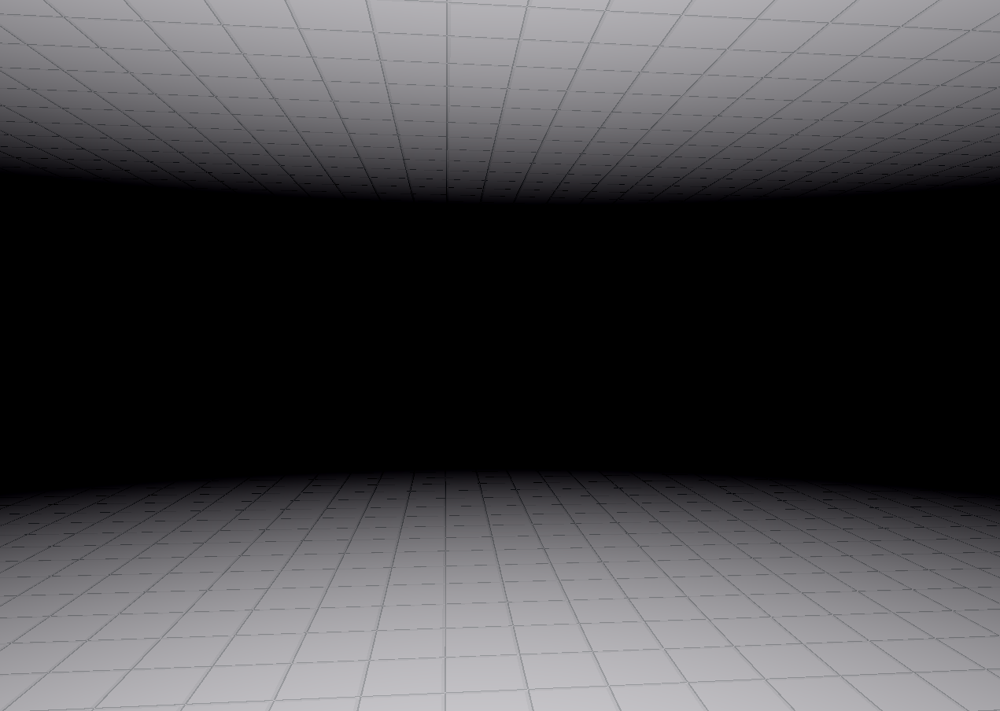

# Construct
WebVR example code - forked from toji's VR-Input example.

> This is an old homework from university.
> Contains outdated WebGL with GLSL shaders.

## Usage
* git clone https://github.com/ugallu/webvr-construct
* cd webvr-construct
* python3 -m http.server
* Open in browser: http://0.0.0.0:8000/construct.html?polyfill=true

Tested with Chrome Version 88.0.4324.96 (Official Build) (64-bit)

## Dev
Mainly the fShader.js does the heavylifting, the vShader just paints a quad.
